# Linear Security Vulnerability & Solution Framework

## 🎯 Vertical Linear Mermaid Diagram

```mermaid
flowchart TD
    START(["🔐 SYSTEM SECURITY ASSESSMENT"])
    
    START --> V1["🚨 VULNERABILITY 1: Cross-Site Scripting (XSS)<br/>• Reflected XSS attacks<br/>• Stored XSS attacks<br/>• DOM-based XSS"]
    V1 --> S1["✅ SOLUTION 1: Input Validation + Output Encoding<br/>• HTML encode all output<br/>• Validate all user inputs<br/>• Use Content Security Policy headers"]
    
    S1 --> V2["🚨 VULNERABILITY 2: SQL Injection<br/>• Union-based attacks<br/>• Blind SQL injection<br/>• Time-based injection"]
    V2 --> S2["✅ SOLUTION 2: Parameterized Queries<br/>• Use prepared statements<br/>• Implement stored procedures<br/>• Apply input validation"]
    
    S2 --> V3["🚨 VULNERABILITY 3: Broken Authentication<br/>• Weak passwords<br/>• No multi-factor auth<br/>• Session fixation"]
    V3 --> S3["✅ SOLUTION 3: Strong Authentication<br/>• Implement MFA<br/>• Enforce password complexity<br/>• Secure session management"]
    
    S3 --> V4["🚨 VULNERABILITY 4: Sensitive Data Exposure<br/>• Unencrypted data storage<br/>• Plain text transmission<br/>• Information leakage"]
    V4 --> S4["✅ SOLUTION 4: Encryption & Data Protection<br/>• Encrypt data at rest<br/>• Use TLS for transmission<br/>• Implement proper key management"]
    
    S4 --> V5["🚨 VULNERABILITY 5: Broken Access Control<br/>• Privilege escalation<br/>• IDOR attacks<br/>• Missing authorization"]
    V5 --> S5["✅ SOLUTION 5: Role-Based Access Control<br/>• Implement least privilege<br/>• Add authorization checks<br/>• Regular access reviews"]
    
    S5 --> V6["🚨 VULNERABILITY 6: Security Misconfiguration<br/>• Default credentials<br/>• Missing security headers<br/>• Unnecessary features enabled"]
    V6 --> S6["✅ SOLUTION 6: Secure Configuration<br/>• Security hardening<br/>• Remove default accounts<br/>• Implement security headers"]
    
    S6 --> V7["🚨 VULNERABILITY 7: Cross-Site Request Forgery<br/>• Unauthorized state changes<br/>• Session riding attacks<br/>• Missing CSRF tokens"]
    V7 --> S7["✅ SOLUTION 7: CSRF Protection<br/>• Implement CSRF tokens<br/>• Validate referrer headers<br/>• Use SameSite cookies"]
    
    S7 --> V8["🚨 VULNERABILITY 8: Vulnerable Dependencies<br/>• Outdated libraries<br/>• Known CVEs<br/>• Supply chain attacks"]
    V8 --> S8["✅ SOLUTION 8: Patch Management<br/>• Regular updates<br/>• Vulnerability scanning<br/>• Dependency monitoring"]
    
    S8 --> V9["🚨 VULNERABILITY 9: Insufficient Logging<br/>• No audit trails<br/>• Missing monitoring<br/>• Poor incident response"]
    V9 --> S9["✅ SOLUTION 9: Comprehensive Monitoring<br/>• Security event logging<br/>• Real-time alerting<br/>• Incident response plan"]
    
    S9 --> V10["🚨 VULNERABILITY 10: Insecure Communication<br/>• Missing HTTPS<br/>• Weak TLS configuration<br/>• Certificate issues"]
    V10 --> S10["✅ SOLUTION 10: Secure Communication<br/>• Enforce HTTPS/TLS 1.3<br/>• Proper certificate management<br/>• HSTS implementation"]
    
    S10 --> SECURE(["🛡️ SECURE SYSTEM ACHIEVED"])
    
    %% Styling
    classDef vulnerability fill:#ffcdd2,stroke:#d32f2f,stroke-width:2px,color:#000
    classDef solution fill:#c8e6c9,stroke:#388e3c,stroke-width:2px,color:#000
    classDef endpoint fill:#e1f5fe,stroke:#0277bd,stroke-width:3px,color:#000
    
    class V1,V2,V3,V4,V5,V6,V7,V8,V9,V10 vulnerability
    class S1,S2,S3,S4,S5,S6,S7,S8,S9,S10 solution
    class START,SECURE endpoint
```



## 📊 ASCII Security Framework

```
┌─────────────────────────────────────────────────────────────────────────┐
│                    🔐 SYSTEM SECURITY ASSESSMENT                        │
└─────────────────────────┬───────────────────────────────────────────────┘
                          │
                          ▼
┌─────────────────────────────────────────────────────────────────────────┐
│ 🚨 VULNERABILITY 1: Cross-Site Scripting (XSS)                         │
│ ├─ Reflected XSS attacks                                                │
│ ├─ Stored XSS attacks                                                   │
│ └─ DOM-based XSS                                                        │
└─────────────────────────┬───────────────────────────────────────────────┘
                          │
                          ▼
┌─────────────────────────────────────────────────────────────────────────┐
│ ✅ SOLUTION 1: Input Validation + Output Encoding                      │
│ ├─ HTML encode all output                                               │
│ ├─ Validate all user inputs                                             │
│ └─ Use Content Security Policy headers                                  │
└─────────────────────────┬───────────────────────────────────────────────┘
                          │
                          ▼
┌─────────────────────────────────────────────────────────────────────────┐
│ 🚨 VULNERABILITY 2: SQL Injection                                       │
│ ├─ Union-based attacks                                                  │
│ ├─ Blind SQL injection                                                  │
│ └─ Time-based injection                                                 │
└─────────────────────────┬───────────────────────────────────────────────┘
                          │
                          ▼
┌─────────────────────────────────────────────────────────────────────────┐
│ ✅ SOLUTION 2: Parameterized Queries                                   │
│ ├─ Use prepared statements                                              │
│ ├─ Implement stored procedures                                          │
│ └─ Apply input validation                                               │
└─────────────────────────┬───────────────────────────────────────────────┘
                          │
                          ▼
┌─────────────────────────────────────────────────────────────────────────┐
│ 🚨 VULNERABILITY 3: Broken Authentication                               │
│ ├─ Weak passwords                                                       │
│ ├─ No multi-factor authentication                                       │
│ └─ Session fixation                                                     │
└─────────────────────────┬───────────────────────────────────────────────┘
                          │
                          ▼
┌─────────────────────────────────────────────────────────────────────────┐
│ ✅ SOLUTION 3: Strong Authentication                                   │
│ ├─ Implement Multi-Factor Authentication                                │
│ ├─ Enforce password complexity                                          │
│ └─ Secure session management                                            │
└─────────────────────────┬───────────────────────────────────────────────┘
                          │
                          ▼
┌─────────────────────────────────────────────────────────────────────────┐
│ 🚨 VULNERABILITY 4: Sensitive Data Exposure                             │
│ ├─ Unencrypted data storage                                             │
│ ├─ Plain text transmission                                              │
│ └─ Information leakage                                                  │
└─────────────────────────┬───────────────────────────────────────────────┘
                          │
                          ▼
┌─────────────────────────────────────────────────────────────────────────┐
│ ✅ SOLUTION 4: Encryption & Data Protection                            │
│ ├─ Encrypt data at rest                                                 │
│ ├─ Use TLS for transmission                                             │
│ └─ Implement proper key management                                      │
└─────────────────────────┬───────────────────────────────────────────────┘
                          │
                          ▼
┌─────────────────────────────────────────────────────────────────────────┐
│ 🚨 VULNERABILITY 5: Broken Access Control                               │
│ ├─ Privilege escalation                                                 │
│ ├─ IDOR (Insecure Direct Object Reference)                             │
│ └─ Missing authorization checks                                         │
└─────────────────────────┬───────────────────────────────────────────────┘
                          │
                          ▼
┌─────────────────────────────────────────────────────────────────────────┐
│ ✅ SOLUTION 5: Role-Based Access Control                               │
│ ├─ Implement principle of least privilege                               │
│ ├─ Add proper authorization checks                                      │
│ └─ Regular access control reviews                                       │
└─────────────────────────┬───────────────────────────────────────────────┘
                          │
                          ▼
┌─────────────────────────────────────────────────────────────────────────┐
│ 🚨 VULNERABILITY 6: Security Misconfiguration                           │
│ ├─ Default credentials in use                                           │
│ ├─ Missing security headers                                             │
│ └─ Unnecessary features enabled                                         │
└─────────────────────────┬───────────────────────────────────────────────┘
                          │
                          ▼
┌─────────────────────────────────────────────────────────────────────────┐
│ ✅ SOLUTION 6: Secure Configuration                                    │
│ ├─ Security hardening procedures                                        │
│ ├─ Remove default accounts                                              │
│ └─ Implement security headers                                           │
└─────────────────────────┬───────────────────────────────────────────────┘
                          │
                          ▼
┌─────────────────────────────────────────────────────────────────────────┐
│ 🚨 VULNERABILITY 7: Cross-Site Request Forgery (CSRF)                   │
│ ├─ Unauthorized state-changing requests                                 │
│ ├─ Session riding attacks                                               │
│ └─ Missing CSRF tokens                                                  │
└─────────────────────────┬───────────────────────────────────────────────┘
                          │
                          ▼
┌─────────────────────────────────────────────────────────────────────────┐
│ ✅ SOLUTION 7: CSRF Protection                                         │
│ ├─ Implement CSRF tokens                                                │
│ ├─ Validate referrer headers                                            │
│ └─ Use SameSite cookie attributes                                       │
└─────────────────────────┬───────────────────────────────────────────────┘
                          │
                          ▼
┌─────────────────────────────────────────────────────────────────────────┐
│ 🚨 VULNERABILITY 8: Vulnerable Dependencies                             │
│ ├─ Outdated libraries and frameworks                                    │
│ ├─ Known CVEs (Common Vulnerabilities)                                  │
│ └─ Supply chain attacks                                                 │
└─────────────────────────┬───────────────────────────────────────────────┘
                          │
                          ▼
┌─────────────────────────────────────────────────────────────────────────┐
│ ✅ SOLUTION 8: Patch Management & Dependency Monitoring                │
│ ├─ Regular security updates                                             │
│ ├─ Automated vulnerability scanning                                     │
│ └─ Dependency monitoring tools                                          │
└─────────────────────────┬───────────────────────────────────────────────┘
                          │
                          ▼
┌─────────────────────────────────────────────────────────────────────────┐
│ 🚨 VULNERABILITY 9: Insufficient Logging & Monitoring                   │
│ ├─ No security audit trails                                             │
│ ├─ Missing real-time monitoring                                         │
│ └─ Poor incident response capabilities                                  │
└─────────────────────────┬───────────────────────────────────────────────┘
                          │
                          ▼
┌─────────────────────────────────────────────────────────────────────────┐
│ ✅ SOLUTION 9: Comprehensive Security Monitoring                       │
│ ├─ Security event logging and audit trails                             │
│ ├─ Real-time alerting and monitoring                                    │
│ └─ Incident response and recovery plans                                 │
└─────────────────────────┬───────────────────────────────────────────────┘
                          │
                          ▼
┌─────────────────────────────────────────────────────────────────────────┐
│ 🚨 VULNERABILITY 10: Insecure Communication                             │
│ ├─ Missing HTTPS encryption                                             │
│ ├─ Weak TLS configuration                                               │
│ └─ SSL certificate issues                                               │
└─────────────────────────┬───────────────────────────────────────────────┘
                          │
                          ▼
┌─────────────────────────────────────────────────────────────────────────┐
│ ✅ SOLUTION 10: Secure Communication Protocols                         │
│ ├─ Enforce HTTPS with TLS 1.3                                          │
│ ├─ Proper SSL certificate management                                    │
│ └─ HSTS (HTTP Strict Transport Security)                               │
└─────────────────────────┬───────────────────────────────────────────────┘
                          │
                          ▼
┌─────────────────────────────────────────────────────────────────────────┐
│                    🛡️ SECURE SYSTEM ACHIEVED                           │
│                                                                         │
│ ✓ All major vulnerabilities addressed                                   │
│ ✓ Defense-in-depth security implemented                                 │
│ ✓ Continuous monitoring and improvement                                 │
└─────────────────────────────────────────────────────────────────────────┘
```